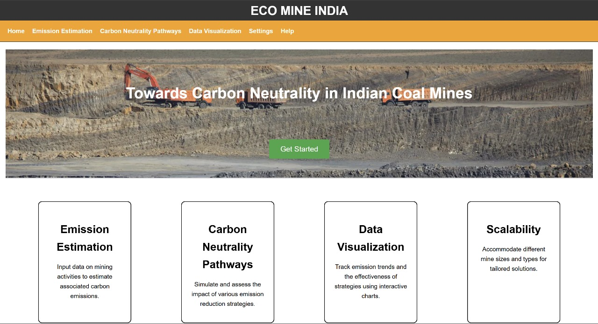

---
# **ECO MINE INDIA**
# **Carbon Neutrality in Indian Coal Mines**

## **Project Overview**

This web-based application is designed to assist Indian coal mines in their journey towards carbon neutrality. It provides tools to quantify carbon emissions, estimate carbon sinks, perform gap analysis, and suggest pathways to achieving carbon neutrality. The application empowers mine operators with data-driven insights to make informed decisions that align with climate change commitments.

## **Objectives**

- **Carbon Emission Estimation**: Quantify carbon emissions from various mining activities, including excavation, transportation, and equipment usage.
- **Per Capita Emissions**: Calculate emissions per worker for a detailed understanding of the environmental impact.
- **Carbon Sinks Estimation**: Estimate the carbon sequestration potential of afforestation efforts and other carbon sinks.
- **Gap Analysis**: Compare total emissions with carbon sinks to identify the gap that needs to be addressed to achieve carbon neutrality.
- **Carbon Neutrality Pathways**: Simulate and assess the impact of different strategies, such as adopting cleaner technologies, increasing afforestation, and reducing energy consumption.
- **Carbon Credits**: Estimate the potential carbon credits earned based on current market rates.
- **Data Visualization**: Present results visually through interactive charts and graphs to track emission trends and strategy effectiveness.
- **Scalability**: The application is designed to accommodate different mine sizes and types, ensuring tailored solutions for underground and open-cast mines.

## **Features**

- **Emission Estimation**: Input data on mining activities to estimate associated carbon emissions.
- **Carbon Neutrality Pathways**: Simulate the impact of various emission reduction strategies.
- **Data Visualization**: Track emission trends and strategy effectiveness with interactive charts.
- **Scalability**: Support for various mine types and sizes.
- **User Settings**: Customize the application with themes and notification preferences.
- **Help Section**: Access to common FAQs and support.

## **Tech Stack**

- **Frontend**: HTML, CSS, JavaScript, Chart.js for data visualization.
- **Backend**: Python with Flask framework.
- **Database**: SQLite (can be scaled to PostgreSQL or MySQL for production).
- **Hosting**: Flask server for backend and static file serving.

## **Images**



## **Installation**

1. **Clone the repository:**
    ```bash
    git clone https://github.com/Manish281005/Eco-Mine-India.git
    cd Carbon-Neutrality-App
    ```

2. **Set up a virtual environment (optional but recommended):**
    ```bash
    python3 -m venv venv
    source venv/bin/activate  # On Windows use `venv\Scripts\activate`
    ```

3. **Install dependencies:**
    ```bash
    pip install -r requirements.txt
    ```

4. **Run the Flask application:**
    ```bash
    flask run
    ```

5. **Access the application in your browser:**
    - Go to `http://127.0.0.1:5000` to view the app.

## **Usage**

- **Home Page**: Provides an overview of the application's purpose and features.
- **Emission Estimation**: Allows users to input data and calculate emissions.
- **Carbon Neutrality Pathways**: Simulates various strategies to achieve carbon neutrality.
- **Data Visualization**: Displays charts and graphs to track emissions and strategy effectiveness.
- **Settings**: Customize the application with your preferred theme and notification settings.
- **Help**: Access FAQs and contact support for assistance.

## **Contributing**

We welcome contributions to this project! If you have suggestions or want to add features, feel free to fork the repository, create a new branch, and submit a pull request.

1. Fork the repository
2. Create a new branch (`git checkout -b feature/your-feature-name`)
3. Commit your changes (`git commit -am 'Add some feature'`)
4. Push to the branch (`git push origin feature/your-feature-name`)
5. Create a new Pull Request

## **License**

This project is licensed under the MIT License. See the `LICENSE` file for details.

## **Contact**

For any questions or suggestions, please contact:
- **Name**: [Your Name]
- **Email**: [Your Email]
- **GitHub**: [Your GitHub Profile]

---

This `README.md` provides a clear and structured overview of your project, making it easy for users and contributors to understand its purpose, features, and how to get started.
